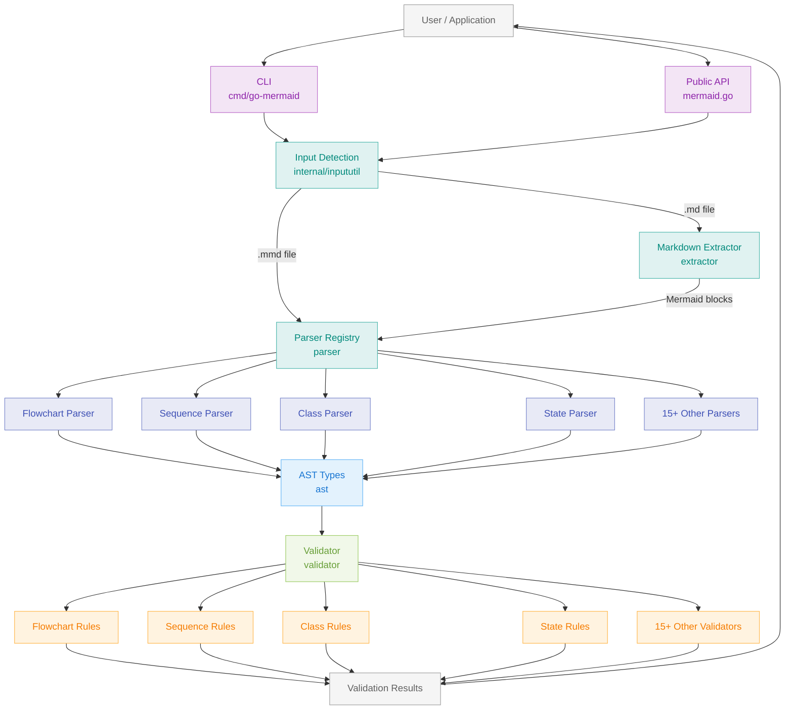

# go-mermaid

A pure Go parser, validator, and linter for Mermaid diagrams.

## What it does

Parse, validate, and lint Mermaid diagram syntax from Go code or the command line. Works with pure Mermaid files (.mmd) and markdown files containing Mermaid code blocks.

**Features:**
- Multiple diagram types in a single markdown file
- Customisable validation rules (default and strict modes)
- Detailed error messages with line numbers
- Auto-detection of diagram types
- Parentheses warnings, comment validation, header checks

**Diagram Type Support Matrix:**

| Diagram Type   | Support Level | AST Parsing | Semantic Validation                          |
|----------------|---------------|-------------|----------------------------------------------|
| Flowchart      | ✅ Full        | ✅ Complete  | ✅ Deep (nodes, links, direction)             |
| Graph          | ✅ Full        | ✅ Complete  | ✅ Deep (nodes, links, direction)             |
| Sequence       | ✅ Full        | ✅ Complete  | ✅ Deep (participants, messages, notes)       |
| Class          | ✅ Full        | ✅ Complete  | ✅ Deep (classes, relationships, members)     |
| State          | ✅ Full        | ✅ Complete  | ✅ Deep (states, transitions, references)     |
| ER             | ✅ Full        | ✅ Complete  | ✅ Deep (entities, attributes, relationships) |
| Gantt          | ✅ Full        | ✅ Complete  | ✅ Deep (tasks, sections, dependencies)       |
| Pie            | ✅ Full        | ✅ Complete  | ✅ Deep (entries, values, labels)             |
| Journey        | ✅ Full        | ✅ Complete  | ✅ Deep (tasks, actors, scores)               |
| GitGraph       | ✅ Full        | ✅ Complete  | ✅ Deep (commits, branches, merges)           |
| Mindmap        | ✅ Full        | ✅ Complete  | ✅ Deep (nodes, hierarchy, shapes)            |
| Timeline       | ✅ Full        | ✅ Complete  | ✅ Deep (periods, events, sections)           |
| Sankey         | ✅ Full        | ✅ Complete  | ✅ Deep (nodes, links, values)                |
| Quadrant       | ✅ Full        | ✅ Complete  | ✅ Deep (points, axes, coordinates)           |
| XYChart        | ✅ Full        | ✅ Complete  | ✅ Deep (series, axes, data)                  |
| C4 (all types) | ✅ Full        | ✅ Complete  | ✅ Deep (elements, relationships, boundaries) |

## Requirements

- Go 1.23.4 or later

## Installation

```bash
go get github.com/sammcj/go-mermaid@HEAD
```

## Usage

### Command line

```bash
# Validate a Mermaid file
go-mermaid diagram.mmd

# Validate markdown with Mermaid blocks
go-mermaid README.md

# Validate from stdin
cat diagram.mmd | go-mermaid

# Force markdown mode
cat content.txt | go-mermaid --format markdown
```

### Library

```go
import "github.com/sammcj/go-mermaid"

// Parse any diagram type (auto-detects)
diagram, err := mermaid.Parse(source)
if err != nil {
    // Handle error
}

// Validate with default rules
errors := mermaid.Validate(diagram, false)

// Validate with strict rules
errors := mermaid.Validate(diagram, true)

// Extract diagrams from markdown
diagrams, err := mermaid.ExtractFromMarkdown(markdownContent)

// Type-specific handling (all diagram types have full AST)
switch d := diagram.(type) {
case *ast.Flowchart:
    fmt.Println("Direction:", d.Direction)
    fmt.Println("Statements:", len(d.Statements))
case *ast.SequenceDiagram:
    fmt.Println("Participants:", len(d.Participants))
    fmt.Println("Statements:", len(d.Statements))
case *ast.ClassDiagram:
    fmt.Println("Classes:", len(d.Classes))
    fmt.Println("Relationships:", len(d.Relationships))
case *ast.StateDiagram:
    fmt.Println("States:", len(d.States))
    fmt.Println("Transitions:", len(d.Transitions))
case *ast.ERDiagram:
    fmt.Println("Entities:", len(d.Entities))
    fmt.Println("Relationships:", len(d.Relationships))
case *ast.GanttDiagram:
    fmt.Println("Tasks:", len(d.Tasks))
    fmt.Println("Sections:", len(d.Sections))
case *ast.GenericDiagram:
    // Fallback for future unsupported types
    fmt.Println("Type:", d.DiagramType)
    fmt.Println("Lines:", len(d.Lines))
}

// Parse flowchart specifically (when you need the full AST)
flowchart, err := mermaid.ParseFlowchart(source)
```

## Validation Capabilities

21+ Mermaid diagram types have **complete AST parsing with deep semantic validation**:

**Core Diagrams:**
- **Flowchart/Graph**: Full AST with nodes, links, subgraphs, direction validation
- **Sequence**: Participants, messages, blocks (alt/opt/loop/par), notes, activation
- **Class**: Classes, members, relationships, visibility modifiers, multiplicity
- **State**: States, transitions, composite states, fork/join/choice nodes (v2 support)

**Data Visualisation:**
- **ER**: Entities, attributes, relationships, cardinality validation
- **Gantt**: Tasks, sections, dependencies, date format validation
- **Pie**: Entries, values, labels
- **Journey**: Tasks, sections, actors, scores
- **Timeline**: Periods, events, sections

**Specialised:**
- **GitGraph**: Commits, branches, merges, cherry-picks, tags
- **Mindmap**: Hierarchical nodes, shapes, icons, levels
- **Sankey**: Links, nodes, flow values
- **Quadrant**: Points, axes, coordinates, quadrant positions
- **XYChart**: Series, axes (categorical/numeric), data points

**C4 Architecture Diagrams:**
- All 5 C4 types (Context, Container, Component, Dynamic, Deployment)
- Elements, relationships, boundaries, tags

**Validation Features:**
- Duplicate identifier detection
- Reference validation (undefined nodes/participants/states)
- Type checking (visibility modifiers, relationship types, directions)
- Syntax validation for diagram-specific elements
- Strict mode for style enforcement

**Error Detection:**
- Detects escaped backticks in markdown (e.g., `\`\`\`mermaid` instead of ` ```mermaid`)
- Provides clear error messages with line numbers
- Identifies missing diagrams in markdown files with helpful hints

**What's Not Supported:**
- Auto-fixing or diagram transformation
- Layout or rendering validation
- Mermaid.js-specific rendering hints

## Performance

Parsing and validation are highly efficient, suitable for real-time use:

**Parser Performance** (Apple M2 Max):
- Flowchart: ~6.3μs per diagram
- Sequence: ~6.5μs per diagram
- Class: ~6.5μs per diagram
- State: ~4.9μs per diagram
- ER: ~0.4μs per diagram
- Gantt: ~12μs per diagram
- Large diagrams (100 nodes): ~110μs

**Validator Performance**:
- Flowchart: ~220ns per diagram
- Sequence: ~545ns per diagram
- Class: ~189ns per diagram
- State: ~315ns per diagram

All parsers meet the <100ms target for diagrams up to 1000 lines. Run benchmarks with `go test -bench=. ./parser/ ./validator/`

### Commands

```bash
# Run all tests
make test

# Run specific module tests
go test ./parser/test/...
go test ./validator/test/...

# Run benchmarks
go test -bench=. ./parser/test/
go test -bench=. ./validator/test/

# Run linter
make lint

# Build binary
make build

# Generate coverage report
make coverage
```

## Architecture

The library is organised into focused packages with clear responsibilities:



**Key Components:**

- **CLI / Public API**: Entry points for command-line and library usage
- **Input Detection**: Auto-detects file types (.mmd, .md, .markdown, .mdx)
- **Markdown Extractor**: Extracts Mermaid code blocks from markdown files
- **Parser Registry**: Dispatches to appropriate parser based on diagram type
- **Type-Specific Parsers**: 21+ parsers, each producing a complete AST
- **AST Types**: Strongly-typed diagram representations implementing `ast.Diagram` interface
- **Validator**: Routes to appropriate validator based on diagram type
- **Type-Specific Validators**: Semantic validation rules for each diagram type

## Development

### Test Structure

Tests are organised in per-module test directories using black-box testing:

```
parser/test/          # Parser tests (17 files)
validator/test/       # Validator tests (18 files)
extractor/test/       # Markdown extraction tests
internal/inpututil/test/  # Input detection tests
testdata/             # Test fixtures organised by diagram type
  flowchart/         # Flowchart test diagrams
  diagrams/          # General diagram test files
  sequence/          # Sequence diagram test files
```

All tests use black-box testing (`package X_test`) to test only the public API.

## Licence

- Apache 2.0 Licensed. See [LICENSE](LICENSE) for details.

## Contributing

Contributions welcome. Please ensure:
- Linter passes with zero warnings (`make lint`)
- All tests pass (`make test`)
- Code coverage remains above 75%
- British English spelling in all code and documentation
- Tests are placed in per-module test directories using black-box testing
